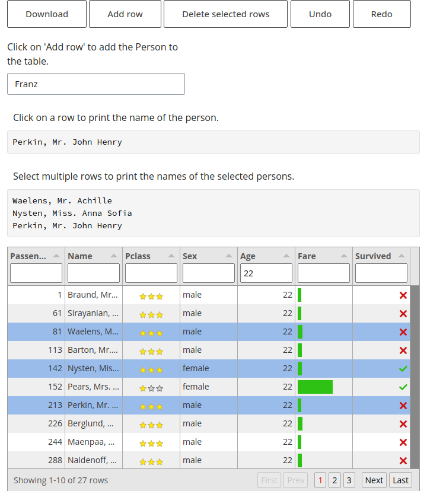

# py-tabulator: Tabulator for Python

[](https://img.shields.io/github/v/release/eodaGmbH/py-tabulator)
[](https://pypi.python.org/pypi/pytabulator)
[](https://img.shields.io/github/actions/workflow/status/eodaGmbH/py-tabulator/pytest.yml?branch=main)
[](https://img.shields.io/github/license/eodaGmbH/py-tabulator)

[Shiny for Python](https://shiny.posit.co/py/) bindings for [Tabulator JS](https://tabulator.info/)

## Features

- Support for [Shiny core](https://shiny.posit.co/py/) and [Shiny Express](https://shiny.posit.co/blog/posts/shiny-express/)
- Pagination
- Filters
- Editor with undo and redo (History interaction)
- Grouping
- Sorting
- Column calculations
- Downloads
- Themes
- Reactivity

## Installation

```bash
# Stable
pip install pytabulator

# Dev
pip install git+https://github.com/eodaGmbH/py-tabulator
```

## Docs

- https://eodagmbh.github.io/py-tabulator/

## Basic usage

Using [Shiny Express](https://shiny.posit.co/blog/posts/shiny-express/):

```python
import pandas as pd
from pytabulator import TableOptions, render_data_frame
from shiny import render
from shiny.express import input, ui

ui.div("Click on row to print name", style="padding: 10px;")


@render.code
async def txt():
    print(input.tabulator_row_clicked())
    return input.tabulator_row_clicked()["Name"]


@render_data_frame(table_options=TableOptions(height=500))
def tabulator():
    return pd.read_csv(
        "https://raw.githubusercontent.com/datasciencedojo/datasets/master/titanic.csv"
    )
```

Run detailed example:

```bash
shiny run docs/examples/getting_started/shiny_express_all.py
```



## Development

### Python

```bash
poetry install

poetry run pytest
```

### JavaScript

```bash
npm install

npm run prettier

npm run build
```
